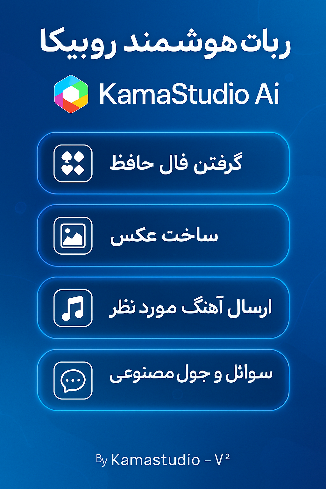

# 🤖 ربات هوش مصنوعی روبیکا – ساخته شده توسط KamaStudio

سلام! 👋  
این پروژه نمونه‌کار یک ربات همه‌کاره برای پلتفرم **روبیکا** است. این ربات به‌صورت تعاملی طراحی شده و قابلیت‌های جذاب و متنوعی را ارائه می‌دهد.

آیدی ربات در روبیکا : **KamaStudioBot**

---

## ✨ امکانات ربات:

🔮 **فال حافظ با طعم کلاسیک**  
فقط کافیه بنویسی `+ فال حافظ` و ربات یه بیت زیبا از حافظ برات می‌فرسته.

🧠 **پاسخگویی هوشمند به سوالات**  
با نوشتن سؤال‌هایی مثل `+ چرا خواب می‌بینیم؟`، ربات با استفاده از هوش مصنوعی، جواب کامل و قابل فهم ارائه می‌ده.

🖼 **ساخت تصویر با هوش مصنوعی**  
مثلاً بفرست: `+ یک گربه فضایی در حال خوردن بستنی روی ماه`  
و در چند ثانیه تصویرش رو دریافت کن!

🎵 **ارسال موسیقی**  
با نوشتن اسم خواننده یا آهنگ، ربات جستجو کرده و لینک دانلود موسیقی رو برات می‌فرسته.

🎁 و امکانات بیشتر در راه است...

---

## 🧾 نحوه استفاده:

کار با این ربات فوق‌العاده ساده‌ست. فقط کافیه در ابتدای پیام‌هات علامت `+` رو بذاری و بعد خواسته‌ات رو بنویسی.  
مثال‌ها:
+ فال حافظ

+ عکس یه جنگل جادویی 

+ آهنگ امین رستمی

+ چرا آسمون آبیه؟

---
## 📷 عکس 

  

---

## ⚠️ نکته مهم

> **این پروژه صرفاً جهت نمایش نمونه‌کار در GitHub منتشر شده**
> تمام طراحی، ایده‌پردازی و پیاده‌سازی متعلق به [KamaStudio](https://KamaGame.ir) بوده و هرگونه کپی‌برداری بدون مجوز ممنوع است.

---

## 📩 ارتباط با ما

سوالی داشتی؟ همکاری خواستی؟ با ما از طریق تیکت در ارتباط باش:
- سایت: [kamastudio.ir](https://KamaGame.ir)

---

**By KamaStudio – V2 AI Assistant Bot for Rubika** 🚀  
